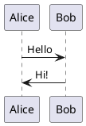

# 贡献指南

## 代码结构

```
.
├── arg.json                # 构建参数矩阵
├── cann/                   # CANN 镜像目录
├── docker-bake.hcl         # Bake 配置
├── mindspore/              # MindSpore 镜像目录
├── python/                 # Python 镜像目录
└── pytorch/                # PyTorch 镜像目录
```



## 

