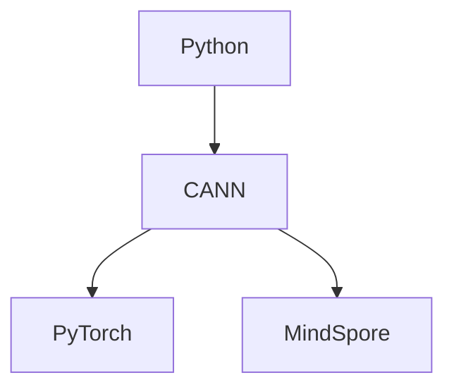

# 贡献指南

## 代码结构

```
.
├── arg.json                # 构建参数矩阵
├── cann/                   # CANN 镜像目录
├── docker-bake.hcl         # Bake 配置
├── mindspore/              # MindSpore 镜像目录
├── python/                 # Python 镜像目录
└── pytorch/                # PyTorch 镜像目录
```

镜像关系如下图所示。

- [python](./python): 由于 CANN Toolkit 依赖 Python 环境，
  因此单独构建 Python 镜像作为 CANN 镜像的基础镜像，其 Python 包采用源码构建而成，
  详情见 [python.sh](./python/python.sh)。

- [cann](./cann): CANN 镜像中安装了 `ascend-cann-toolkit` 和 `ascend-cann-kernels`
  以及运行时必要的依赖，详情见 [cann.sh](./cann/cann.sh)。

- [pytorch](./pytorch): PyTorch 镜像将 CANN 镜像作为基础镜像，
  同时安装了 `torch` 和 `torch_npu`，详情见 [Dockerfile](./pytorch/Dockerfile)。

- [mindspore](./mindspore): MindSpore 镜像将 CANN 镜像作为基础镜像，
  同时安装了 `mindspore`，详情见 [Dockerfile](./mindspore/Dockerfile)。



## 镜像构建

提供两种镜像构建方式：使用 [Bake][0] 构建和使用传统的 `docker build` 构建。

- Bake 构建方式：CI/CD 中使用 Bake 来构建镜像，以此简化构建配置。
  Bake 配置文件见 [docker-bake.hcl](./docker-bake.hcl) 和 [arg.json](./arg.json)。
  其中 `docker-bake.hcl` 中定义了各类镜像的构建配置，`arg.json` 中定义了各类镜像的构建参数。

- 传统构建方式：对于需要自定义构建镜像的用户，可以选择使用传统的 `docker build` 方式。

[0]: https://docs.docker.com/build/bake/

## CI/CD

基于 GitHub Actions 构建 CI/CD 系统，运行在 [GitHub-hosted runner][10] 上。

提交 Pull request 时可触发镜像构建，只有当 release 时才会发布镜像。
工作流运行详情见：[actions/workflows/docker.yml][11]。

> [!NOTE]  
> 为节省服务器资源，只有 Pull request 中添加了对应的 [label][12]，才会构建相应的镜像。

[10]: https://github.com/actions/runner-images
[11]: https://github.com/openmerlin/dockerfile/actions/workflows/docker.yml
[12]: https://github.com/openmerlin/dockerfile/labels
